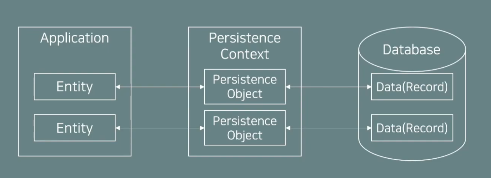

## JPA란?
JPA란 Java Persistance API의 약자로 자바의 ORM(Object Relational Mapping) 표준 스펙에 대한 정의를 뜻한다.
JPA의 스펙은 자바의 객체와 데이터베이스를 어떻게 매핑하고 동작해야 하는지를 정의하고 있다.

## Dependency 설정

아래와 같이 Dependency 추가

```xml
 <!-- Maven 을 사용하는 경우 -->
  <dependencies>
    <!-- https://mvnrepository.com/artifact/org.hibernate/hibernate-core -->
    <dependency>
      <groupId>org.hibernate</groupId>
      <artifactId>hibernate-core</artifactId>
      <version>5.6.1.Final</version>
    </dependency>

    <!-- https://mvnrepository.com/artifact/org.mariadb.jdbc/mariadb-java-client -->
    <dependency>
      <groupId>org.mariadb.jdbc</groupId>
      <artifactId>mariadb-java-client</artifactId>
      <version>2.7.3</version>
    </dependency>
  </dependencies>
```

```groovy
// Gradle 을 사용하는 경우
dependencies {
    //...
    implementation 'org.hibernate:hibernate-core:5.6.1.Final'
    runtimeOnly 'org.mariadb.jdbc:mariadb-java-client'
    //...
}
```

## 영속성 컨텍스트 (Persistence Context)
영속성 컨텍스트(Persistence Context)는 JPA가 관리하는 엔티티 객체의 집합
엔티티 객체가 영속 컨텍스트에 들어오게 되면 JPA는 엔티티 객체의 매핑정보를 가지고 DB에 반영함
엔티티 객체가 영속 컨텍스트에 들어오게 되어 관리대상이 되면 그 객체를 영속 객체라고 부름


영속성 컨텍스느는 세션 단위로 생명주기를 갖고 있음 (세션이 생기면서 만들어지고, 세션이 종료되면 소멸)
영속성 컨텍스트에 접근하기 위해 EntityManager를 사용함

EntityManager 는 하나의 세션으로 보고 아래와 같은 Life Cycle 을 가진다
1. EntityManager 생성 (EntityManagerFactory 를 통해 생성)
2. EntityManager 가 가지고 있는 트랜잭션(Transaction) 을 시작
3. EntityManager 를 통해 영속 컨텍스트에 접근하고 객체를 작업
4. 트랜잭션을 커밋(Commit) 하여 DB에 반영
5. EntityManager 종료

## 엔티티 (Entity) 클래스
JPA 어노테이션을 활용하여 엔티티 클래스를 정의하며 주요 어노테이션은 아래와 같음
- @Entity : 해당 클래스가 JPA 엔티티 클래스라고 정의
- @Table : 해당 클래스가 데이터베이스의 어느 테이블에 매핑되는지 정의
- @Id : DB 테이블의 Primary Key 컬럼과 매핑
- @Column : 매핑할 테이블의 컬럼명과 필드 변수의 이름이 다른 경우 매핑하기 위해 사용


